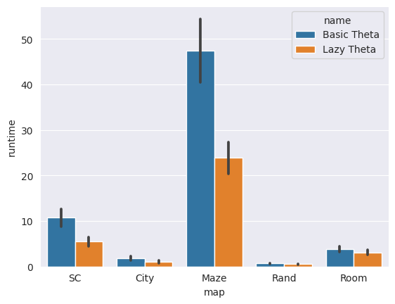

# Полученные результаты по итогам экспериментов

## 2^k A*

* Канонический 2^k A* значительно быстрее классической версии

* С увеличением k существенно уменьшается длина пути и немного увеличивается время работы. 

* На практике почти для любых карт эвристика h_2k хуже, чем расстояние евклида.

*Карта из игры Startcraft, на 3 других результаты аналогичные*

*Карта Random*

## Theta

* Lazy Theta значительно быстрее Basic Theta

* Theta Angle Propagation на сложных для алгоритма (но не на всех) картах даёт существенный выигрыш в скорости взамен на длину пути

* Новая взвешенная эвристика позволяет находить более короткие пути, но увеличивает время работы

*Карта City*

*Карта Random*

## Сравнение разных алгоритмов

* Чаще самый быстрый алгоритм -- 2^k A* за счёт быстрого раскрытия вершин. Алгоритм Anya имеет более сложную логику раскрытия и требует больше времени, зато общее число раскрытий значительно меньше. Theta делает примерно столько же раскрытий, сколько и 2^k A*, а сложность логики и необходимое время немногим меньше, чем у Anya, поэтому этот алгоритм значительно долше других

*Карта Starcraft*

*Карта City*

*Карта Maze*

*Карта Random*

*Карта Room*

* Все алгоритмы находят очень близкие к оптимальным пути

*На всех картах результаты практически одинаковые*

